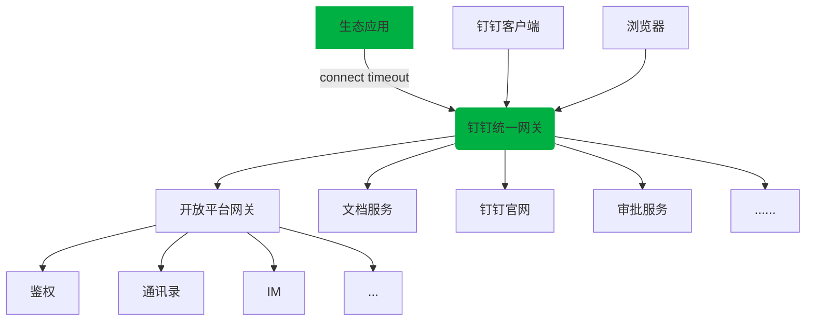

# 网络连接问题错误诊断与解决

但你调用钉钉 API 出现网络连接问题时候，可以参考本文档解决。

类似的错误信息如下：

```text
https://oapi.dingtalk.com/ ... java.net.SocketTimeoutException: connect timedout
com.taobao.api.ApiException: java.net.SocketTimeoutException: connect timedout
```

## 问题诊断

你的应用到钉钉开放平台 API 服务访问的网络拓扑如下（图中绿色部分）：



:::info
钉钉统一网关是一个 HTTPS 的负载均衡服务，为钉钉各个业务系统提供统一的网络接入，只有成功完成网络接入，才会将请求转发给各个业务系统。
:::

通过以上网络拓扑，可以知道，如果你的应用访问钉钉统一网关出现网络连接超时，有以下几种可能的原因：

1. 钉钉统一网关服务异常
2. 区域性甚至是全国性的电信运营商网络异常
3. 特定 IP 被运营商误拦截
4. 你的应用所在服务器、机房网络异常

针对以上四种可能的原因，分别对应以下诊断方法和解决方案。

## 原因一：钉钉统一网关服务异常

可以通过两种方式判断是否为“钉钉统一网关服务异常”

1. 在[钉钉服务状态中心](https://status.dingtalk.com/)查看钉钉各个产品的服务状态，绿色标识正常运行，其他状态表示异常；
2. 在社交媒体上查看钉钉官方账号发布的公告，以及社交媒体热搜。原因是一旦出现“钉钉统一网关服务异常”，钉钉绝大部分产品将无法正常提供服务。在社交媒体中，无论是热搜还是钉钉官方账号，都会有相应的信息发布；

解决方案：

1. 通过社交媒体等渠道，查看钉钉官方发布的公告；
2. 如果贵公司是专属版客户，可以通过企业管理员，联系钉钉的专属客户经理，由钉钉客户经理为贵公司持续提供相应支持服务；

## 原因二：电信运营商网络异常

可以通过以下方式判断是否为“电信运营商网络异常”：

1. 如果是**全国性**的电信运营商网络异常，各大主流媒体会发布相关信息，并且各大社交媒体热搜也有会相关信息更新；
2. 如果是**区域性**的电信运营商网络异常，相应的地方媒体会发布相关信息，并且你周边亲戚、朋友，同地域其他公司也会遇到相同问题；

解决方案：

1. 关注相关媒体后续公告，了解问题修复进展；
2. 如果你是当地电信、移动、联通等运营商的大客户，可以通过运营商的客户经理和技术支持寻求进一步帮助；

## 原因三：特定 IP 被运营商误拦截

电信、移动、联通等运营商在日常维护中，会对恶意和非法的网络接入做拦截和管控，过程中如果出现误拦截也会导致特定地域、特定网络环境下访问钉钉异常。

可以通过以下方式判断是否为“特定 IP 被运营商误拦截“

1. 切换运营商网络可以访问，例如从移动切换为电信、从电信切换为联通等
2. 有些地域可以，有些地域访问出错
3. 访问钉钉报错，访问其他网站可以

解决方案：修改 hosts 绑定其他可用 IP

操作步骤：

1. 在这里（[https://dnsdaquan.com/](https://dnsdaquan.com/)） 输入访问出错的域名，查询这个域名的所有可用 IP 列表；或者在其他你熟悉的 DNS 网站查询域名对应的 IP 列表；
2. 从中选取一个 IP，修改 /etc/hosts 文件，写入域名的 IP 绑定信息（ Windows 参考这个[链接](https://developer.aliyun.com/article/706009)）；
3. 方法二不行的话，可以换个 IP 重试；

通过绑 Hosts 方式只能临时应急处置，如果以上方法可行，则确认了问题原因，可以通过[钉钉技术支持](/docs/explore/support)提交运营商、地域、域名以及无法访问的 IP，钉钉的技术支持会跟进该问题彻底解决。

## 原因四：你的应用所在服务器、机房网络异常

可以通过以下方式判断是否为“你的应用所在服务器、机房网络异常”：

1. 通过 dig 命令诊断域名解析，例如 `dig api.dingtalk.com`
2. 通过 ping 命令诊断网络联通性，例如 `ping api.dingtalk.com`
4. 通过 traceroute 命令诊断网络链路，例如 `traceroute api.dingtalk.com`

:::caution
1. 将以上命令中的域名更换为系统错误日志中出现异常的服务域名，例如 api.dingtalk.com，oapi.dingtalk.com 或其他日志中打印的域名；
2. 务必在出现网络异常的应用服务器上执行，而不是在你本机的笔记本电脑上；
3. Windows 上，请将 traceroute 更换为 tracert
:::

通过以上命令可以基本上确定网络原因，特别是 traceroute 命令。可以将以上三个命令执行结果截个图发送给贵公司网络管理员寻求帮助。

解决方案：

1. 将以上三个命令执行结果截个图发送给贵公司网络管理员寻求帮助；
2. 查看应用服务器 iptable，以及服务器所在机房的网络配置最近是否有变更，可以尝试回滚变更，或者查看网络防火墙配置定位和解决；

如果以上方法无法解决问题，可以通过[钉钉技术支持](/docs/explore/support)需求帮助，提交问题时候，请将以上三个命令（dig、ping、traceroute）的执行截图一同提交。

补充说明：如果是你的应用服务器或者机房网络异常的话，钉钉侧能提供的帮助非常有限，你的网络管理员，以及网络设备的供应商可以更好的为你提供现场服务支持。


## 相关链接

* 钉钉服务状态中心：https://status.dingtalk.com/
* 钉钉官方微博账号：https://weibo.com/u/5482144242