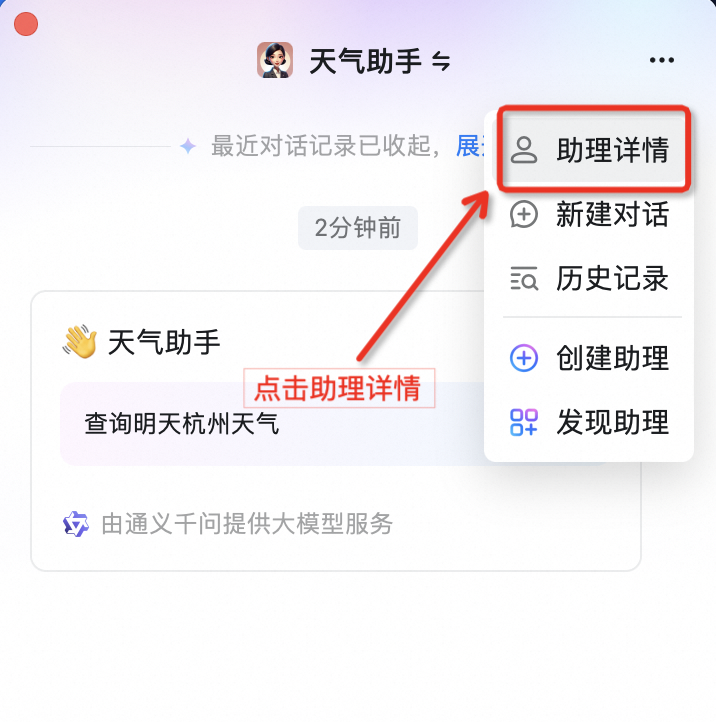
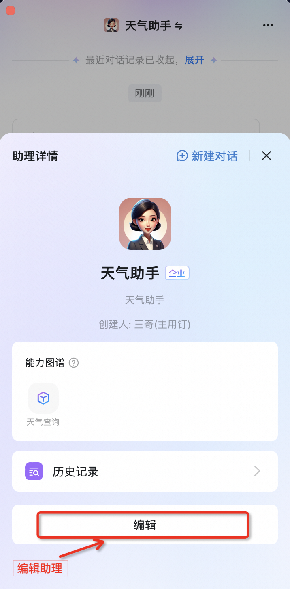
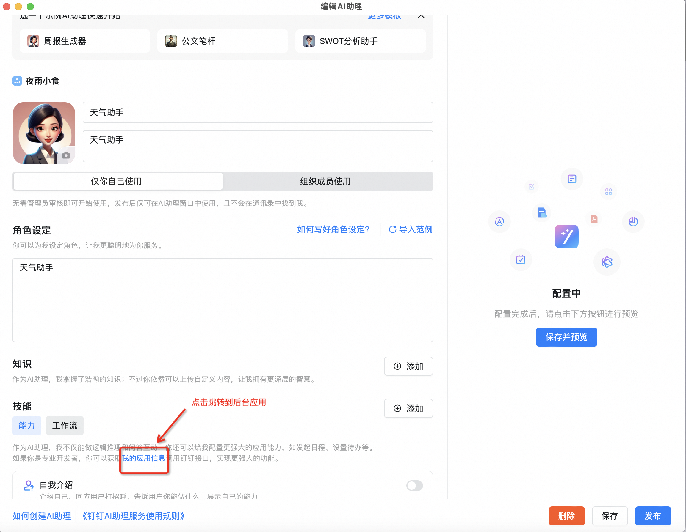
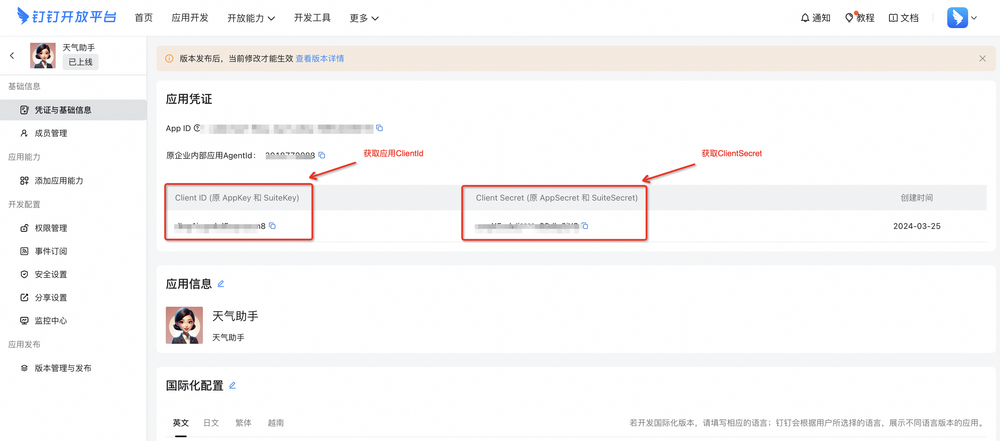

# 2. 创建自定义能力


## 开发示例

本文以官方天气查询功能为例，详细介绍如何通过在 OpenAPI 配置文件中支持 Stream模式。我们以钉钉 AI 助理提供的官方示例天气查询为例介绍 Stream 模式的配置。

### 步骤一：编写接口的 OpenAPI 描述文件

:::note 说明
编写符合 OpenAPI 3.0 规范的描述文件描述上述接口（语法规范参考标准 [OpenAPI Specification](https://swagger.io/specification/?spm=ding_open_doc.document.0.0.5c252f20aEt5pw), 格式校验使用 [Swagger Editor](https://editor.swagger.io/?spm=ding_open_doc.document.0.0.5c252f20aEt5pw)）。
:::

:::caution 注意事项
* 接口描述的字段中，summary，description，operationId 为必填字段：
* summary：简短的动宾结构的短语，例如：查询天气。
* description：接口的详细描述信息。
* operationId：接口的唯一标识符，建议驼峰式的英文命名。
* 同一个接口中请勿声名重名的参数。
* POST 接口的请求和响应当前仅支持 application/json 格式
* POST 接口参数支持 object 类型，且只能支持一层参数结构（更多能力，敬请期待！）
:::

开发者可以通过协议扩展字段 x-dingtalk-protocol 来指定通信协议，启用 Stream 模式可以参考如下配置
```yaml
x-dingtalk-protocol: stream
```
我们以官方的天气查询为例， 支持 Stream 模式的 yaml配置文件下所示
```yaml
openapi: 3.0.1
info:
  title: 天气查询
  description: 按地区和日期来查看天气信息，了解气温、湿度、风向等信息。非真实天气数据，仅用于演示，请勿在生产中使用。
  version: 1.0.0
x-dingtalk-protocol: stream
paths:
  /v1/actions/example/weather/get:
    get:
      description: 查询特定地区的天气信息
      summary: 查询天气
      operationId: GetCurrentWeather
      parameters:
        - name: location
          in: query
          description: 地区
          required: true
          schema: 
            type: string
        - name: date
          in: query
          description: 日期
          required: false
          schema: 
            type: string
      responses:
        200:
          description: OK
          content:
            application/json:
              schema:
                $ref: '#/components/schemas/GetWeatherResponse'
components:
  schemas:
    GetWeatherResponse:
      type: object
      properties:
        location:
          type: string
          description: 查询天气结果对应的城市和地区
        date:
          type: string
          description: 查询天气结果对应的日期
        text:
          type: string
          description: 天气现象，晴天、多云等
        temperature:
          type: number
          description: 气温，单位：摄氏度
        humidity:
          type: number
          description: 湿度
        wind_direction:
          type: string
          description: 风向
```
其他高级自定义能力可以参考官方文档[高级设置](https://open.dingtalk.com/document/ai-dev/actions-advanced-settings)


### 步骤二：获取应用凭证
使用 Stream 协议开发高级自定义能力需要获取 AI 助理的应用凭证信息，您可以通过以下步骤获取当前 AI 助理的应用凭证信息

#### Step1: 打开 AI 助理详情

#### Step2: 点击编辑AI助理

#### Step3: 点击应用信息

#### Step4: 获取应用身份凭证


获取到应用凭证之后，我们就可以开始服务端的代码开发。


